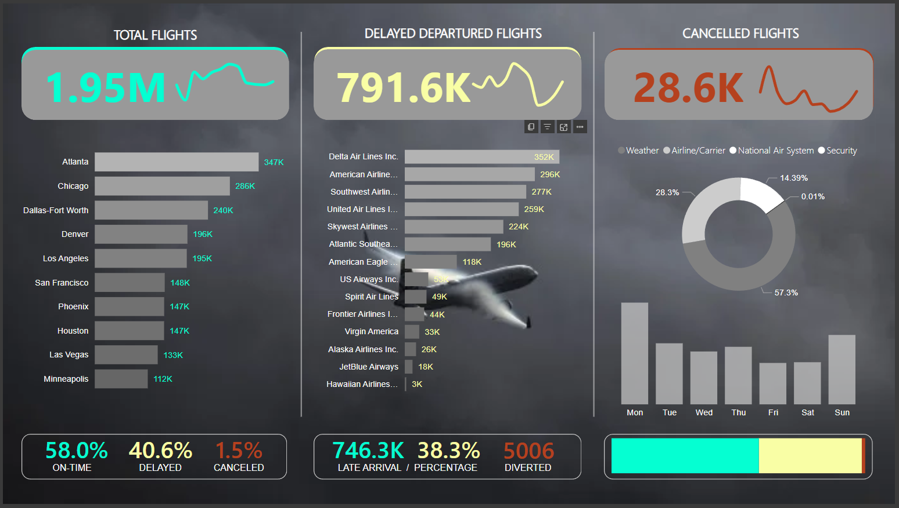

# United State Airline Flights Analysis

Analyzing the US Airline flights total number of scheduled flight, total delayed (departure and arrival), total cancelled and what are the causes of delay or cancellation reasons for the past 12 months on different city airports.
##
Full page link of the Interactive Power BI Dashboard can be found here - [US Airline Flights](https://app.powerbi.com/view?r=eyJrIjoiMTc3NGY1MWQtNjEwNi00ODAwLWJjMDctMGYyNjdhMzQxNjc1IiwidCI6ImE0ZTc4YjgxLTg3NGEtNDgzMi04OGYwLTEyYmQxNjMxMDhmNCIsImMiOjEwfQ%3D%3D)

## Key points and Highlights
  - Identify total number of flights and how many percentages on those flights are On-Time, Delayed, Cancelled or Diverted
  - Monthly flight trend for the past 12 months
  - Total number of flights on every City Airports
  - Total number of flights on each Airlines
  - Reason of cancellations or delay and weekly trend
  - Total late arrival and diverted flights

### Metrics

- Total Flights
   -  Total Flights, Total Cancelled Flight, Total Departure Delayed, Total On-Time
- Percentages
  -  % On-Time, Cancelled, Delay 
- Total Arrival Delayed and % Arrival Delayed
- Total Diverted and % Diverted

## Insights
- Total Flights of 1.95m for the past 12 months from 14 Airlines and 10 US City Airports
   -  1.13m On-Time flights (58% of total flights)
   -  790.5k Delayed departure flights (40.5%)
   -  561.8k Delayed arrival flights (38.3%)  
   -  28.6k Cancelled flights (1.5%)
   -  5k diverted flights
- Atlanta Airport (374k) had the highest total number of flights followed by Chicago (286k) and Dallas (240k) that makes Top 3 US airports with the highest number of total flights
   -  Atlanta Airport accept flights significantly from the Delta Airline with 222k flights. For Dallas aiport, it is the American Airlines (134k)
- Top 5 Airlines with highest total number of flights are Delta Airlines (352k), followed by American Airline (296k), Southwest Airline (277k), United Airlines (259k) and Skywest Airline (224k)
   -  Top 1 Delta Airlines, had a 222k flights on Atlanta airport
   -  Out of 14 Airlines, Hawaiian Arlines had the highest On-Time percentage (75.6%) of their total flights, followed by Alaska Airline (75.2%), although take note that their combined total of flights are only 30k
   -  While in 14 Airlines with the minimum flight of at least 100k, Atlantic Southeast (196k) Airlines had the highest On-Time percentage.
   -  United Airlines had the highest rate of Delayed flight with 53.5%
- Month of February (156k) had the lowest number of flights while July (190k) had the highest
- September (51.8k) had the lowest delayed flight while June (88.5k) had the highest
- September (676) had the lowest cancelled flight while February (6k) had the highest
- Weather (57.3%) was the top reaons of cancellation of flight with total of 16k flights cancelled, followed by Airline/Carrier problem - 8k (28.3%) and National Air System - 4k (14.39%)
- Monday (6.8k) had the most number of cancelled flight

##
